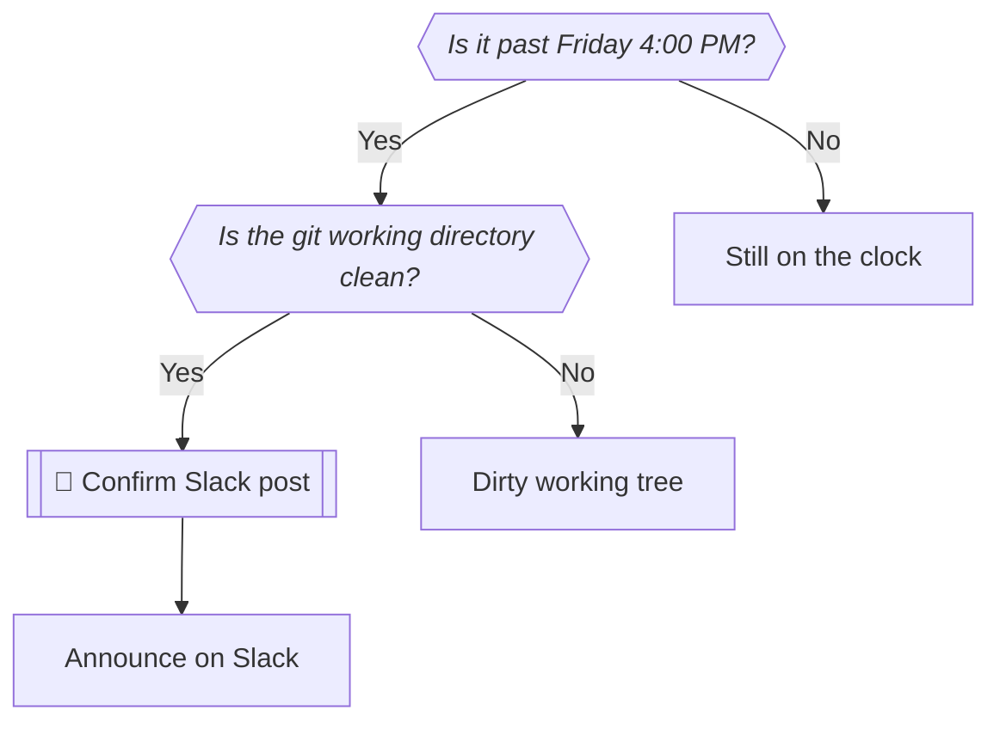

# @lukstei/wf

> Deterministic skill workflow runner for AI agents

[](https://github.com/lukstei/wf/actions/workflows/ci.yml)
[](https://opensource.org/licenses/MIT)
[](https://www.npmjs.com/package/@lukstei/wf)

> [!NOTE]
> `wf` is currently in alpha (`v0.1.x`). Expect bugs and breaking changes.

When you give an AI coding agent a multi-step plan, it tries to execute the whole thing at once. It skips tests, hallucinates future steps, and blows past human review points.

`wf` turns Markdown runbooks into step graphs and feeds them to the agent one step at a time. The agent cannot see or run future steps until the current step passes.

Works in Google Antigravity, Claude Code, and OpenAI Codex.

## Quickstart

### 1. Write a workflow (`weekend.md`)

```markdown
# Weekend Readiness Protocol

Decide whether it is safe to clock out for the weekend.

## 1. If: Is it past Friday 4:00 PM?
Check the current day and local time.

### If: Is the git working directory clean?
Run `git status --porcelain` to check for unstaged or uncommitted changes.

#### Gate: Confirm Slack post
Ready to notify the team that you are heading out?

#### Announce on Slack
Use the Slack CLI to post "Happy weekend!" to #general.

### No: Dirty working tree
Say: "Commit your changes before going home!"

## No: Still on the clock
Calculate the remaining time and say: "Sorry, you still have X days and X hours left to work."
```

### 2. Preview the graph (`/wf-show`)

Inspect the workflow structure before or during execution:

| Environment | Command |
| :--- | :--- |
| Google Antigravity / Claude Code | `/wf-show weekend.md` |
| OpenAI Codex | `$wf:wf-show weekend.md` |



### 3. Run in chat

| Environment | Command |
| :--- | :--- |
| Google Antigravity / Claude Code | `/wf weekend.md` |
| OpenAI Codex | `$wf:wf weekend.md` |

## How it works

- **One step at a time:** The agent prompt only contains instructions for the active step. Future steps stay hidden.
- **Agent does the work, runner enforces the path:** The agent inspects code, runs tools, and evaluates conditions. `wf` strictly controls step transitions, context injection, and gates.
- **Explicit branch decisions:** Conditional steps require `[DECISION: YES]` or `[DECISION: NO]` before the graph advances.
- **Human approval gates:** Steps marked `## Gate:` pause execution until you confirm with `/wf-next`.
- **Zero infrastructure:** Runs entirely local as an in-process plugin. No server, database, or background daemon.

## Installation

### Google Antigravity
```bash
agy plugin install https://github.com/lukstei/wf
```

### Claude Code
From your terminal:
```bash
claude plugin marketplace add lukstei/wf
claude plugin install wf@wf-marketplace
```

Or inside an active session:
```bash
/plugin marketplace add lukstei/wf
/plugin install wf@wf-marketplace
```

### OpenAI Codex
```bash
codex plugin marketplace add lukstei/wf
codex plugin install wf
codex plugin trust wf
```

> [!NOTE]
> Codex currently displays hook feedback in the transcript ([openai/codex#21696](https://github.com/openai/codex/issues/21696)). `wf` emits `suppressOutput: true`, which will hide these messages once upstream support is enabled.

## Commands

| Command (Claude / AGY) | Command (Codex CLI) | Description |
| :--- | :--- | :--- |
| `/wf <file>` | `$wf:wf <file>` | Start a workflow and inject step 1. Supports relative paths, `@path`, or `@[path]`. |
| `/wf-show [<file>]` | `$wf:wf-show [<file>]` | Display workflow status and Mermaid diagram. Visualizes a file when provided. |
| `/wf-next` | `$wf:wf-next` | Advance to the next step when paused at a gate. |
| `/wf-stop` | `$wf:wf-stop` | Abort and reset the active workflow. |
| `/wf-help` | `$wf:wf-help` | Display usage instructions and supported runner commands. |

## Syntax at a glance

See [docs/SYNTAX.md](docs/SYNTAX.md) for the complete specification.

- `# Title`: Workflow title. Any text before the first `##` is global preamble context injected into every step.
- `## Step name`: Linear step. Body text becomes step instructions.
- `## If: Condition`: Branch point. Child `###` subheadings form the YES branch; `### No:` forms the NO branch. Agent decides with `[DECISION: YES]` or `[DECISION: NO]`.
- `## Gate: Name`: Human checkpoint. Execution halts until `/wf-next`.

## FAQ

### What does "deterministic workflow runner" mean?

Deterministic means the **execution boundary and graph traversal are strictly controlled in code**, while the **task logic and condition evaluation remain with the agent**.

- **Deterministic by the runner:** Step sequence, active step visibility, human gates, and transition states are deterministic. The agent cannot skip ahead, hallucinate upcoming steps, or bypass review points because future steps are physically absent from its prompt.
- **Evaluated by the agent:** The agent retains full flexibility inside each step to read files, run terminal commands, write code, and evaluate conditions. When evaluating a condition, the agent inspects the system state and returns `[DECISION: YES]` or `[DECISION: NO]`.

### How is this different from giving the agent a markdown checklist in the prompt?

When an agent receives a 10-step checklist in a single prompt, it tries to execute as much as possible at once. It frequently skips tests, hallucinates that future steps already succeeded, or ignores instructions to stop for human review. `wf` reveals only step $N$. Step $N+1$ does not exist in the agent's context until step $N$ completes.

### Does `wf` require external services or API keys?

No. `wf` is a single bundled script (`dist/wf.cjs`) invoked directly by agent lifecycle hooks. It stores lightweight state in your project directory and requires no backend, database, or external network calls.

### Can existing `SKILL.md` runbooks be used?

Yes. Any standard Markdown document with `##` headings works immediately. You can also run the built-in `wf-convert` skill to convert procedural instructions into deterministic step graphs.

## Development

```bash
npm install
npm run verify      # runs tests and tsc
npm run build       # builds dist/wf.cjs
npm run test:watch  # test watcher
```

## License

[MIT](LICENSE) © 2026 Lukas Steinbrecher

