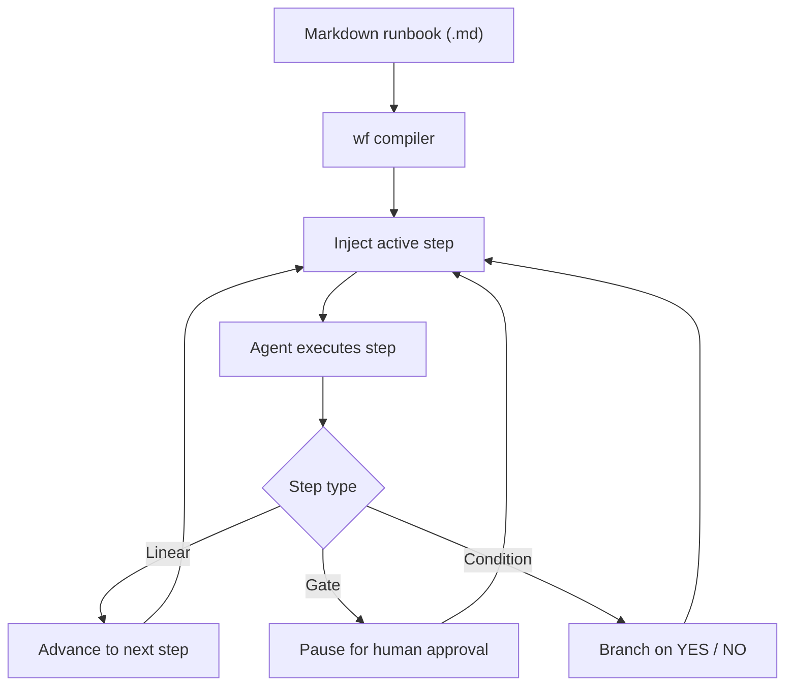

# @lukstei/wf

> Deterministic skill workflow runner for AI agents

[](https://github.com/lukstei/wf/actions/workflows/ci.yml)
[](https://opensource.org/licenses/MIT)
[](https://www.npmjs.com/package/@lukstei/wf)

> [!NOTE]
> `wf` is currently in alpha (`v0.1.x`). Expect bugs and breaking changes.

When you give an AI coding agent a multi-step plan, it tries to execute the whole thing at once. It skips tests, hallucinates future steps, and blows past human review points.

`wf` turns Markdown runbooks into step graphs and feeds them to the agent one step at a time. The agent cannot see or run future steps until the current step passes.

Runs in Google Antigravity, Claude Code, and OpenAI Codex.



## Goals

- **Skills as workflows:** Turn existing `SKILL.md` files and Markdown runbooks into executable workflows with minimal changes.
- **Minimal syntax:** Plain Markdown headings, conditions, and human gates. No custom DSL.
- **Agent does the work:** The model inspects code, runs tools, and evaluates conditions. `wf` only enforces step order and human checkpoints.
- **Zero infrastructure:** Runs as a self-contained plugin. No server, database, or background daemon.

## Non-goals

- **Full-blown workflow engine:** No heavy orchestration frameworks, distributed graph runners, or complex runtime dependencies.

## How it works

- **One step at a time:** The agent prompt only contains instructions for the active step. Future steps stay hidden.
- **Explicit branch decisions:** Conditional steps require `[DECISION: YES]` or `[DECISION: NO]` before the graph advances.
- **Human gates:** Steps marked `## Gate:` pause execution until you run `/wf-next`.
- **Visual status:** Generates Mermaid diagrams showing the current position in the graph.
- **Zero runtime dependencies:** Single bundle in `dist/wf.cjs` invoked directly by agent lifecycle hooks.

## Supported environments

| Environment | Commands | Lifecycle hooks |
| :--- | :--- | :--- |
| Google Antigravity | `/wf`, `/wf-show`, `/wf-next`, `/wf-stop`, `/wf-help` | `PreInvocation`, `Stop` |
| Claude Code | `/wf`, `/wf-show`, `/wf-next`, `/wf-stop`, `/wf-help` | `SessionStart`, `UserPromptSubmit`, `Stop` |
| OpenAI Codex | `$wf:wf`, `$wf:wf-show`, `$wf:wf-next`, `$wf:wf-stop`, `$wf:wf-help` | `SessionStart`, `UserPromptSubmit`, `Stop` |

## Installation

### Google Antigravity
Install using the Antigravity CLI:
```bash
agy plugin install https://github.com/lukstei/wf
```

### Claude Code
From your terminal (CLI):
```bash
claude plugin marketplace add lukstei/wf
claude plugin install wf@wf-marketplace
```

Or inside an active Claude Code session:
```bash
/plugin marketplace add lukstei/wf
/plugin install wf@wf-marketplace
```

### OpenAI Codex
Add the marketplace catalog, install, and trust:
```bash
codex plugin marketplace add lukstei/wf
codex plugin install wf
codex plugin trust wf
```

> [!NOTE]
> Codex currently displays hook feedback and step continuation prompts in the transcript/TUI ([openai/codex#21696](https://github.com/openai/codex/issues/21696)). `wf` emits `suppressOutput: true`, which will automatically hide these messages once upstream support is enabled.

## Quickstart

### 1. Write a workflow (`deploy.md`)

```markdown
# Production Deployment

Ensure all checks pass before deploying.

## 1. Run tests
Run the test suite:
`npm run verify`

## 2. If: Did all tests pass?

### Publish
Publish packages to npm and create GitHub release.

### No
Stop and report the failures.

## Gate: Confirm release
Check the files in `dist/`. Ready to publish to production?
```

### 2. Run in chat

In Antigravity or Claude Code:

```text
/wf deploy.md
```

In OpenAI Codex:

```text
$wf:wf deploy.md
```

| Command (Claude Code / AGY) | Command (Codex CLI) | Description |
| :--- | :--- | :--- |
| `/wf <workflow-file>` | `$wf:wf <workflow-file>` | Start a workflow and inject step 1. Supports relative paths, `@path`, or `@[path]`. |
| `/wf-show [<workflow-file>]` | `$wf:wf-show [<workflow-file>]` | Display workflow status, Mermaid diagram, and current step. Visualizes a file when provided. |
| `/wf-next` | `$wf:wf-next` | Advance and execute the next step when a workflow is paused at a gate. |
| `/wf-stop` | `$wf:wf-stop` | Stop and reset the active or paused workflow. |
| `/wf-help` | `$wf:wf-help` | Display usage instructions and supported runner commands. |

## Syntax

See [docs/SYNTAX.md](docs/SYNTAX.md) for the complete syntax specification, rules, and examples.

### Frontmatter (optional)
YAML frontmatter at the top of the file configures the workflow name and description:
```markdown
---
name: deploy
description: Production release workflow
---
```

### Workflow Preamble (Context)
Any text between the H1 title and the first step heading is treated as top-level workflow context. It is injected into every step under `CONTEXT:`:
```markdown
# Production Deployment

Ensure DATABASE_URL is pointing to staging replica before running checks.
All commands must be executed from repository root.
```

### Steps (`##`)
Any H2 heading that does not match a keyword (`if`, `gate`) creates a step. Heading numbers or prefixes are supported:
```markdown
## 1. Run migrations
Run `./scripts/migrate.sh` and verify all tables migrate cleanly.
```

### Conditions (`## If:` / `### No`)
Condition headings create binary branching points evaluated dynamically by the model:
- **Condition Instruction**: Body text directly beneath `## If:` tells the agent how to evaluate the condition.
- **YES Branch (0..N steps)**: Child `###` subheadings are executed when the condition evaluates to YES.
- **NO Branch**: A child heading `### No` (or `### Else`) is executed when the condition evaluates to NO.

The agent concludes its evaluation with `[DECISION: YES]` or `[DECISION: NO]`:

```markdown
## 2. If: Any migrations pending?
Run `npx prisma migrate status` to check the database state.

### Run dry-run
Run migration dry-run and save output.

### No: Skip verification
Skip to schema verification.
```

### Gates (`## Gate:`)
Pauses execution for human review. Resumes when you run `/wf-next`:
```markdown
## Gate: Confirm schema changes
Review the schema diff above. Run `/wf-next` to continue or `/wf-stop` to abort.
```

## Development

```bash
npm install
npm run verify      # runs tests and tsc
npm run build       # builds dist/wf.cjs
npm run test:watch  # test watcher
```

## License

[MIT](LICENSE) © 2026 Lukas Steinbrecher
