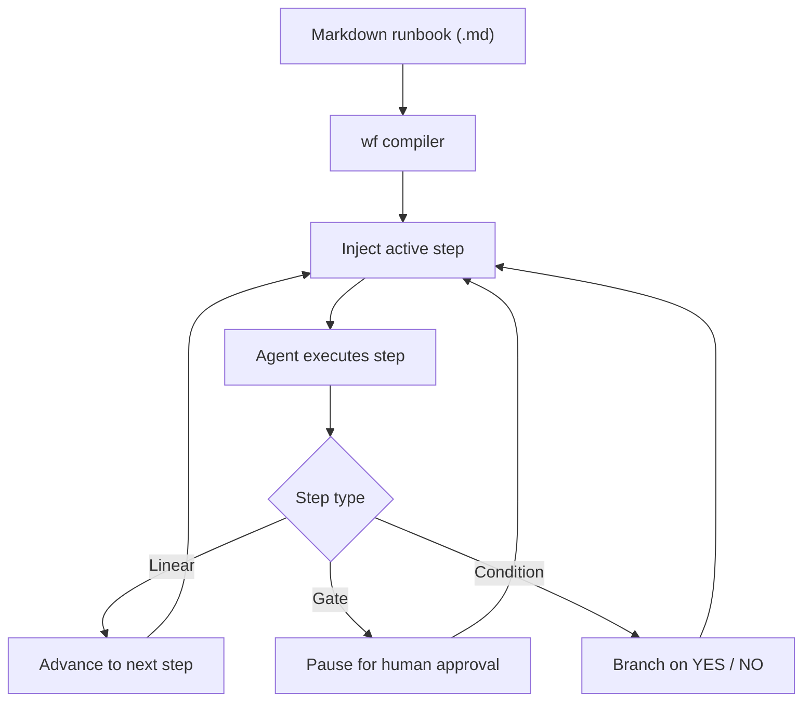

# @lukstei/wf

> Deterministic skill workflow runner for AI agents

[](https://github.com/lukstei/wf/actions/workflows/ci.yml)
[](https://opensource.org/licenses/MIT)
[](https://www.npmjs.com/package/@lukstei/wf)

> [!NOTE]
> `wf` is currently in alpha (`v0.1.x`). Expect bugs and breaking changes.

When you give an AI coding agent a multi-step plan, it tries to execute the whole thing at once. It skips tests, hallucinates future steps, and blows past human review points.

`wf` turns Markdown runbooks into step graphs and feeds them to the agent one step at a time. The agent cannot see or run future steps until the current step passes.

Runs in Google Antigravity, Claude Code, OpenAI Codex, and the terminal.



## Goals

- **Skills as workflows:** Turn existing `SKILL.md` files into executable workflows with minimal changes.
- **Minimal syntax:** Plain Markdown headings, conditions, and human gates. No custom DSL.
- **Agent does the work:** The model inspects code, runs tools, and evaluates conditions. `wf` only enforces step order and human checkpoints.
- **Zero infrastructure:** Runs as a single, self-contained plugin. No server, database, or background daemon.

## Non-goals

- **Full-blown workflow engine:** No heavy orchestration frameworks, distributed graph runners, or complex runtime dependencies.

## How it works

- **One step at a time:** The agent prompt only contains instructions for the active step. Future steps stay hidden.
- **Explicit branch decisions:** Conditional steps require `[DECISION: YES]` or `[DECISION: NO]` before the graph advances.
- **Human gates:** Steps marked `## Gate:` stop execution until you run `/wf-next`.
- **Visual status:** Generates Mermaid diagrams showing the current position in the graph.
- **Single bundle:** Bundled into `dist/hook-shim.cjs` with zero runtime dependencies.

## Supported environments

| Environment | Chat command | Terminal CLI | Lifecycle hooks |
| :--- | :---: | :---: | :--- |
| Google Antigravity | `/wf` | `wf` | `PreInvocation`, `Stop` |
| Claude Code | `/wf` | `wf` | `UserPromptSubmit`, `Stop` |
| OpenAI Codex | `/wf` | `wf` | `UserPromptSubmit`, `Stop` |
| Terminal / Scripts | — | `wf` | Standard stdin / stdout / exit codes |

## Installation

CLI:
```bash
npm install -g @lukstei/wf
```

Google Antigravity:
```bash
git clone https://github.com/lukstei/wf.git ~/.gemini/config/plugins/wf
```

Claude Code:
```bash
/plugin marketplace add lukstei/wf
/plugin install wf@wf-marketplace
```

## Quickstart

### 1. Write a workflow (`deploy.md`)

```markdown
# Production Deployment

Ensure all checks pass before deploying.

## Step 1: Tests
Run the test suite:
`npm run verify`

### If: Did all tests pass?
Build release artifacts.

### Else
Stop and report the failures.

## Gate: Confirm release
Check the files in `dist/`. Ready to publish to production?

## Step 2: Publish
Publish packages to npm and create GitHub release.
```

### 2. Run in chat

In Antigravity, Claude Code, or Codex:

```text
/wf deploy.md
```

- `/wf <file>`: Start a workflow and inject step 1.
- `/wf-show`: Print status, current step, and Mermaid chart.
- `/wf-next`: Continue after a gate.
- `/wf-stop`: Cancel the active workflow.
- `/wf-help`: Show command help.

## Syntax

### Steps (`##`)
Any H2 heading creates a step:
```markdown
## 1. Run migrations
Run `./scripts/migrate.sh` and verify all tables migrate cleanly.
```

### Context (`### Pre:`)
Adds setup instructions before the step runs:
```markdown
### Pre: Database setup
Set `DATABASE_URL` to the staging replica.
```

### Conditions (`### If:` and `### Else`)
Forces binary routing. The agent must return `[DECISION: YES]` or `[DECISION: NO]`:
```markdown
### If: Any migrations pending?
Run migration dry-run and save output.

### Else
Skip to verification.
```

### Gates (`## Gate:`)
Pauses execution for human review:
```markdown
## Gate: Confirm schema changes
Review the schema diff above. Run `/wf-next` to continue.
```

## Development

```bash
npm install
npm run verify      # runs tests and tsc
npm run build       # builds dist/hook-shim.cjs
npm run test:watch  # test watcher
```

## License

[MIT](LICENSE) © 2026 Lukas Steinbrecher
