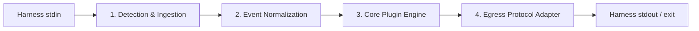

# Universal Agent Plugin Architecture, Packaging & Publishing Guide
**Supporting Google Antigravity (AGY), Anthropic Claude Code, and OpenAI Codex from a Single Repository**

---

## 1. Executive Summary & Core Axiom

As AI coding harnesses proliferate—**Google Antigravity (AGY)**, **Anthropic Claude Code**, **OpenAI Codex CLI**, and editor extensions like **VS Code Copilot**, **OpenCode**, and **Cursor**—plugin authors face an architectural fragmentation problem:

- **Conflicting Manifests**: Different file names, schemas, and discovery paths (`plugin.json`, `.claude-plugin/plugin.json`, `.codex-plugin/plugin.json`, `marketplace.json`).
- **Incompatible Lifecycle Protocols**: Disparate event triggers, payload casing (camelCase protojson vs. snake_case JSON), and control signals (exit code `2` vs. JSON stdout decisions).
- **Execution Constraints**: Claude Code and Codex cache plugins without running `npm install`; commands must be self-contained and cross-platform (PowerShell, `cmd /c`, `sh -c`).

### The Core Axiom: "Write Once, Target All"
Maintaining separate plugins per harness leads to drift, broken synchronization, and 3x maintenance overhead. The industry-proven solution (exemplified by reference plugins like **Ponytail**) is a **Universal Single-Source Architecture**:
1. **Shared Knowledge & Rules**: A single set of `skills/` (`SKILL.md`) and behavioral instructions (`AGENTS.md`) shared across all harnesses.
2. **Dedicated Manifest Zones**: Cleanly partitioned manifest subdirectories (`.claude-plugin/`, `.codex-plugin/`, `.agents/`) that co-exist peacefully without collision.
3. **Zero-Dependency Bundled Hook Shim**: A single, bundled Node.js script (`dist/hook-shim.cjs`) built via `esbuild` that auto-detects the host harness, normalizes incoming stdin events, calls the core plugin logic, and translates egress decisions to the host's native protocol.

---

## 2. The Big Three Harness Specification Matrix

| Architectural Dimension | Google Antigravity (AGY) | Anthropic Claude Code | OpenAI Codex CLI |
| :--- | :--- | :--- | :--- |
| **Plugin Manifest** | Project: `.agents/plugins/<name>/plugin.json`<br>Global: `~/.gemini/config/plugins/<name>/plugin.json` | Project/Global: `.claude-plugin/plugin.json`<br>*(or portable root `plugin.json`)* | Project/Global: `.codex-plugin/plugin.json`<br>*(or portable root `plugin.json`)* |
| **Hook Manifest** | `plugins/<name>/hooks.json`<br>*(or `.agents/hooks.json`)* | Points via manifest: `"hooks": "./hooks/claude-codex-hooks.json"` | Points via manifest: `"hooks": "./hooks/claude-codex-hooks.json"` |
| **Marketplace Catalog** | `.agents/plugins/marketplace.json` | `.claude-plugin/marketplace.json` | Remote catalog / Codex Marketplace |
| **Payload Casing** | **camelCase** (protojson serialization) | **snake_case** | **snake_case** (with alias fallbacks) |
| **Lifecycle Events** | `PreToolUse`, `PostToolUse`, `PreInvocation`, `PostInvocation`, `Stop` | `SessionStart`, `UserPromptSubmit`, `PreToolUse`, `PostToolUse`, `Stop`, `SubagentStart`, `SubagentStop` | `SessionStart`, `UserPromptSubmit`, `PreToolUse`, `PostToolUse`, `Stop` |
| **Tool Matchers** | Regex in `matcher`: `"run_command\|view_file"` | Pipe pattern: `"Bash\|Edit\|Write"` | Pattern / String: `"Bash\|apply_patch"` |
| **Blocking Mechanism** | JSON stdout: `{"decision": "deny", "reason": "..."}` | **Exit Code 2** (+ feedback on `stderr`) | **Exit Code 2** (+ `stderr`) or `permissionDecision: "deny"` |
| **Tool Input Modification** | JSON stdout `overwrite` (**shallow top-level merge**) | JSON stdout `updatedInput` (**wholesale object replacement**) | Restricted; deny + prompt guidance preferred |
| **Context Injection** | `PreInvocation`: `{"injectSteps": [{"ephemeralMessage": "..."}]}` | `{"hookSpecificOutput": {"additionalContext": "..."}}` | `{"systemMessage": "...", "hookSpecificOutput": {"additionalContext": "..."}}` |
| **Autonomous Loop Continuation** | `Stop`: `{"decision": "continue", "reason": "..."}` | `Stop`: `decision: "block"` / `additionalContext` | `Stop`: `systemMessage` / quality gate exit code |
| **Root Environment Variable** | None (CWD = folder containing `hooks.json`) | `CLAUDE_PLUGIN_ROOT` | `CLAUDE_PLUGIN_ROOT` (compat) |
| **State Storage Variable** | Passed via stdin (`artifactDirectoryPath`) | `CLAUDE_PLUGIN_DATA` | `PLUGIN_DATA` |

---

## 3. Empirical Case Studies: How Top Plugins Do It

### 3.1 The Reference Model: `ponytail` (v4.9.0)
Inspected locally at `/Users/Lukas.Steinbrecher/.gemini/config/plugins/ponytail/`, Ponytail supports 13+ harnesses (Claude Code, Codex, Copilot, AGY/Gemini CLI, OpenCode, Pi, Qoder, Cursor, Windsurf, Cline) from a single repo:

```text
ponytail/
├── .agents/plugins/marketplace.json    # AGY Marketplace catalog
├── .claude-plugin/                     # Claude Code manifest & marketplace
│   ├── marketplace.json
│   └── plugin.json
├── .codex-plugin/                      # Codex manifest with interface metadata
│   └── plugin.json
├── .github/copilot-instructions.md     # Copilot instructions
├── .cursor/rules/ponytail.mdc          # Cursor MDC rule mirror
├── .windsurf/rules/ponytail.md         # Windsurf rule mirror
├── .clinerules/ponytail.md             # Cline rule mirror
├── AGENTS.md                           # Universal root guidelines
├── package.json                        # NPM package & OpenCode/Pi pointers
├── plugin.json                         # Fallback root manifest
├── hooks/
│   ├── claude-codex-hooks.json         # Shared Claude & Codex hook declarations
│   ├── ponytail-runtime.js             # Universal runtime detection & output router
│   ├── ponytail-activate.js            # SessionStart handler
│   ├── ponytail-mode-tracker.js        # UserPromptSubmit handler
│   └── ponytail-subagent.js            # SubagentStart handler
└── skills/                             # Universal SKILL.md folders
```

### 3.2 Critical Pitfalls & Empirical Discoveries

#### 1. The `hooks/hooks.json` Name Collision Trap
- **The Problem**: Gemini CLI / Antigravity automatically scans for and loads any file named `hooks/hooks.json` at the repository root. Because AGY does not support Claude Code hook events (`SessionStart`, `UserPromptSubmit`), placing a `hooks/hooks.json` file in the root causes Gemini CLI / AGY to error or fail on boot.
- **The Solution**: Name the shared Claude/Codex hook manifest `hooks/claude-codex-hooks.json`. Reference it explicitly inside `.claude-plugin/plugin.json` and `.codex-plugin/plugin.json`. Place AGY hooks in `.agents/plugins/<name>/hooks.json` or `plugins/<name>/hooks.json`.

#### 2. The Windows PowerShell Stdin Hang
- **The Problem**: On Windows, Claude Code executes hook commands via PowerShell inside conditional scriptblocks. PowerShell's pipe handling frequently fails to transmit `EOF` to child Node processes. Calling `process.stdin.on('end')` hangs indefinitely, freezing the entire agent CLI.
- **The Solution**: Always attach an unref'd timeout fallback to standard input reads:
  ```javascript
  let input = '';
  let handled = false;
  function finish() {
    if (handled) return;
    handled = true;
    runLogic(input);
  }
  process.stdin.on('data', chunk => { input += chunk; });
  process.stdin.on('end', finish);
  // Guarantee exit even if EOF is swallowed by Windows PowerShell
  setTimeout(finish, 1000).unref();
  ```

#### 3. Stripping UTF-8 Byte Order Marks (BOM)
- **The Problem**: Windows shells prepend `\uFEFF` when piping JSON into standard input, causing `JSON.parse()` to throw `Unexpected token '\uFEFF'`.
- **The Solution**: Always strip BOM: `const data = JSON.parse(rawInput.replace(/^\uFEFF/, ''));`.

#### 4. Avoiding `commandWindows` in Manifests
- **The Problem**: While Claude Code docs previously suggested a `commandWindows` field in `hooks.json`, Anthropic's official marketplace submission validator rejects `commandWindows` as unrecognized schema.
- **The Solution**: Use a single, cross-platform invocation with quoted variables:
  ```json
  "command": "node \"${CLAUDE_PLUGIN_ROOT}/hooks/script.js\""
  ```
  Never use `exec node`, `command -v`, `&&`, or bashisms inside hook commands, as PowerShell will immediately crash with `CommandNotFoundException`.

#### 5. The Zero-Dependency / No-Install Constraint
- **The Problem**: Neither Claude Code nor Codex runs `npm install` when installing a plugin from a marketplace. If your hook requires external npm modules (e.g. `mdast-util-from-markdown`), the hook crashes with `MODULE_NOT_FOUND`.
- **The Solution**: Compile the hook script and all dependencies into a single, self-contained file using `esbuild`:
  ```bash
  esbuild src/shim/runtime-shim.ts --bundle --platform=node --target=node18 --format=cjs --outfile=dist/hook-shim.cjs
  ```

---

## 4. Universal Repository File Layout

This layout allows a single repository to serve AGY, Claude Code, Codex, and NPM simultaneously with zero duplicate logic:

```text
my-plugin/
├── .agents/                          # [AGY Ecosystem Zone]
│   ├── plugins/
│   │   ├── marketplace.json          # AGY marketplace catalog
│   │   └── my-plugin/                # Project-level AGY plugin entry
│   │       ├── plugin.json           # AGY manifest
│   │       └── hooks.json            # AGY lifecycle dispatch table
│   └── rules/
│       └── AGENTS.md                 # Symlink or copy of root AGENTS.md
│
├── .claude-plugin/                   # [Claude Code Zone]
│   ├── marketplace.json              # Claude Code marketplace catalog
│   └── plugin.json                   # Manifest pointing to hooks & skills
│
├── .codex-plugin/                    # [OpenAI Codex Zone]
│   └── plugin.json                   # Codex manifest with UI interface block
│
├── skills/                           # [Shared Skills - Single Source of Truth]
│   └── my-skill/
│       └── SKILL.md                  # Standard skill specification
│
├── rules/                            # [Shared Guidelines]
│   └── AGENTS.md                     # Canonical behavioral rules
│
├── hooks/                            # [Declarative Hook Manifests]
│   └── claude-codex-hooks.json       # Shared Claude/Codex hook definitions
│
├── src/                              # [TypeScript Source Code]
│   ├── shim/
│   │   ├── runtime-shim.ts           # Universal CLI entry point (stdin buffering)
│   │   ├── detect.ts                 # Runtime harness detection
│   │   ├── normalizer.ts             # Ingestion: maps payloads -> NormalizedEvent
│   │   └── egress.ts                 # Egress: maps NormalizedResult -> harness protocol
│   ├── core/
│   │   ├── engine.ts                 # Agnostic plugin business logic
│   │   └── state.ts                  # Multi-session state persistence
│   └── index.ts                      # Library export
│
├── dist/                             # [Bundled Zero-Dependency Production Output]
│   ├── hook-shim.cjs                 # Single self-contained CJS bundle for all hooks
│   └── cli.cjs                       # CLI helper for npm/npx installations
│
├── scripts/                          # [Validation & CI Tooling]
│   ├── check-schemas.js              # Validates marketplace.json & plugin.json schemas
│   └── check-versions.js             # Enforces lockstep versioning across all manifests
│
├── esbuild.config.js                 # Bundler config producing dist/hook-shim.cjs
├── package.json                      # NPM package manifest & root config
├── plugin.json                       # Portable fallback root manifest
├── AGENTS.md                         # Universal root instructions
└── README.md                         # Documentation
```

---

## 5. Universal Hook Shim Architecture

The Universal Hook Shim decouples the host harness from plugin business logic via a 4-stage pipeline:



### 5.1 Stage 1: Harness Detection (`src/shim/detect.ts`)

```typescript
export type HarnessType = "claude" | "codex" | "agy" | "copilot" | "unknown";

export function detectHarness(rawPayload: Record<string, any>, env = process.env): HarnessType {
  // 1. Explicit environment markers
  if (env.COPILOT_PLUGIN_DATA || (env.CLAUDE_PLUGIN_ROOT && env.CLAUDE_PLUGIN_ROOT.includes(".vscode"))) {
    return "copilot";
  }
  if (env.PLUGIN_DATA || env.CODEX_SESSION_ID) {
    return "codex";
  }
  if (env.AGY_HOOK_ACTIVE || env.GEMINI_CLI) {
    return "agy";
  }
  if (env.CLAUDE_PLUGIN_ROOT || env.CLAUDE_PROJECT_DIR) {
    return "claude";
  }

  // 2. Payload structural heuristics
  if (rawPayload.conversationId && (rawPayload.stepIdx !== undefined || rawPayload.transcriptPath)) {
    return "agy";
  }
  if (rawPayload.tool_name !== undefined || rawPayload.stop_hook_active !== undefined) {
    return "claude";
  }
  if (rawPayload.hookEventName) {
    return "codex";
  }

  return "claude"; // Safe fallback
}
```

### 5.2 Stage 2: Event Normalization (`src/shim/normalizer.ts`)

Converts diverse payloads into three agnostic lifecycle primitives:

```typescript
export type NormalizedEvent =
  | { type: "tool_use"; toolName: string; args: Record<string, any>; conversationId: string }
  | { type: "user_prompt"; prompt: string; conversationId: string }
  | { type: "agent_stop"; isInterrupted: boolean; stopHookActive: boolean; conversationId: string };

export function normalizeInput(
  harness: HarnessType,
  payload: Record<string, any>,
  modeArg?: string
): NormalizedEvent {
  const conversationId = String(
    payload.conversationId || payload.session_id || payload.sessionId || "default"
  );

  // Stop events
  if (modeArg === "stop" || payload.terminationReason || payload.stop_hook_active !== undefined) {
    return {
      type: "agent_stop",
      isInterrupted: Boolean(payload.terminationReason && /cancel|abort|interrupt/i.test(payload.terminationReason)),
      stopHookActive: Boolean(payload.stop_hook_active),
      conversationId,
    };
  }

  // Tool use events
  if (modeArg === "tool" || payload.toolCall || payload.tool_name) {
    const toolName = payload.toolCall?.name || payload.tool_name || "unknown";
    const args = payload.toolCall?.args || payload.tool_input || {};
    return { type: "tool_use", toolName, args, conversationId };
  }

  // User prompt / Pre-invocation events
  const prompt = payload.prompt || payload.userPrompt || "";
  return { type: "user_prompt", prompt, conversationId };
}
```

### 5.3 Stage 3: Core Plugin Logic (`src/core/engine.ts`)

Pure business logic returning an agnostic result:

```typescript
export interface EngineResult {
  decision: "allow" | "deny" | "continue" | "inject";
  reason?: string;
  injectedContext?: string;
  modifiedArgs?: Record<string, any>;
}
```

### 5.4 Stage 4: Egress Protocol Adapter (`src/shim/egress.ts`)

```typescript
export function writeEgress(harness: HarnessType, event: NormalizedEvent, result: EngineResult): void {
  // Anti-recursion guard for Claude Code Stop hooks
  if (event.type === "agent_stop" && event.stopHookActive && result.decision === "continue") {
    process.exit(0);
  }

  switch (harness) {
    case "claude": {
      if (event.type === "tool_use") {
        if (result.decision === "deny") {
          process.stderr.write(result.reason || "Action denied by plugin.");
          process.exit(2); // Hard block in Claude Code
        }
        process.exit(0);
      }

      if (event.type === "agent_stop") {
        if (result.decision === "continue" && result.reason) {
          process.stdout.write(JSON.stringify({ decision: "block", reason: result.reason }));
          process.exit(0);
        }
        process.exit(0);
      }

      if (event.type === "user_prompt") {
        if (result.injectedContext) {
          process.stdout.write(result.injectedContext);
        }
        process.exit(0);
      }
      process.exit(0);
      break;
    }

    case "agy": {
      if (event.type === "tool_use") {
        const agyResponse: Record<string, any> = {
          decision: result.decision === "deny" ? "deny" : "allow",
        };
        if (result.reason) agyResponse.reason = result.reason;
        if (result.modifiedArgs) agyResponse.overwrite = result.modifiedArgs;
        process.stdout.write(JSON.stringify(agyResponse));
        process.exit(0);
      }

      if (event.type === "agent_stop") {
        const agyResponse: Record<string, any> = {
          decision: result.decision === "continue" ? "continue" : "allow",
        };
        if (result.reason) agyResponse.reason = result.reason;
        process.stdout.write(JSON.stringify(agyResponse));
        process.exit(0);
      }

      if (event.type === "user_prompt") {
        const agyResponse = result.injectedContext
          ? { injectSteps: [{ ephemeralMessage: result.injectedContext }] }
          : {};
        process.stdout.write(JSON.stringify(agyResponse));
        process.exit(0);
      }
      process.exit(0);
      break;
    }

    case "codex": {
      const output: Record<string, any> = {};
      if (event.type === "tool_use") {
        output.hookSpecificOutput = {
          hookEventName: "PreToolUse",
          permissionDecision: result.decision === "deny" ? "deny" : "allow",
          permissionDecisionReason: result.reason || "",
        };
      } else if (result.injectedContext || result.reason) {
        output.hookSpecificOutput = {
          hookEventName: event.type === "agent_stop" ? "Stop" : "UserPromptSubmit",
          additionalContext: result.reason || result.injectedContext || "",
        };
      }
      process.stdout.write(JSON.stringify(output));
      process.exit(0);
      break;
    }

    default:
      process.exit(0);
  }
}
```

---

## 6. State & Session Persistence Patterns

CLI hooks execute as isolated, short-lived child processes. To maintain persistent state across turns (e.g. tracking workflow step progress in `wf`), use **atomic, session-keyed disk persistence**:

```typescript
// src/core/state.ts
import * as fs from "node:fs";
import * as path from "node:path";
import * as os from "node:os";

export function getStateFilePath(conversationId: string): string {
  // Respect harness persistent state variables
  const baseDir =
    process.env.PLUGIN_DATA ||
    process.env.CLAUDE_PLUGIN_DATA ||
    path.join(os.homedir(), ".wf", "sessions");

  fs.mkdirSync(baseDir, { recursive: true });
  // Sanitize conversationId to prevent directory traversal
  const safeId = conversationId.replace(/[^a-zA-Z0-9_\-]/g, "_");
  return path.join(baseDir, `wf-${safeId}.json`);
}

export function saveStateAtomic(conversationId: string, data: Record<string, any>): void {
  const target = getStateFilePath(conversationId);
  const temp = `${target}.tmp.${Date.now()}.${Math.random().toString(36).slice(2, 8)}`;
  fs.writeFileSync(temp, JSON.stringify(data, null, 2), "utf-8");
  fs.renameSync(temp, target); // Atomic filesystem replacement
}
```

---

## 7. Packaging & Publishing Playbook

### 7.1 Publishing to Claude Code Marketplaces
1. **Repository Structure**: Host the repository publicly on GitHub (e.g., `https://github.com/your-org/wf`).
2. **Marketplace Catalog**: Ensure `.claude-plugin/marketplace.json` is committed at the repository root:
   ```json
   {
     "$schema": "https://anthropic.com/claude-code/marketplace.schema.json",
     "name": "wf-marketplace",
     "owner": { "name": "Your Org", "url": "https://github.com/your-org" },
     "plugins": [
       {
         "name": "wf",
         "description": "Deterministic step-by-step workflow runner",
         "source": "./",
         "category": "productivity"
       }
     ]
   }
   ```
3. **User Installation**:
   ```bash
   /plugin marketplace add your-org/wf
   /plugin install wf@wf-marketplace
   ```

### 7.2 Publishing to AGY (Antigravity)
1. **Workspace Inclusion**: Include `.agents/plugins/wf/` in the repository root. Any developer cloning the repository automatically inherits `wf`.
2. **Registry Inclusion**: Register the repository in `.agents/plugins/marketplace.json`:
   ```json
   {
     "name": "wf",
     "source": {
       "source": "url",
       "url": "https://github.com/your-org/wf.git",
       "ref": "main"
     }
   }
   ```
3. **Global Machine Install**: Users can clone or symlink the repository into `~/.gemini/config/plugins/wf`.

### 7.3 Publishing to OpenAI Codex CLI
1. **Manifest Configuration**: Configure `.codex-plugin/plugin.json` with capabilities and interface definitions.
2. **User Installation & Cryptographic Trust**:
   ```bash
   codex plugin marketplace add your-org/wf
   codex plugin install wf
   codex plugin trust wf
   ```
   *(Note: Codex records a SHA-256 hash of `dist/hook-shim.cjs`; any untrusted edits post-install require explicit user re-trust).*

### 7.4 Publishing to NPM Registry
1. **Build Step**: Bundle the zero-dependency runtime: `npm run build`.
2. **Configure `package.json`**:
   - `files`: Include `dist/`, `skills/`, `rules/`, `hooks/`, `.claude-plugin/`, `.codex-plugin/`, `.agents/`, `AGENTS.md`.
   - `bin`: Provide an interactive installer (`"wf-agent": "./bin/cli.cjs"`).
3. **Publish via OIDC**:
   ```bash
   npm publish --provenance --access public
   ```
4. **End-User Fast Setup**:
   ```bash
   npx @your-org/wf init
   ```

---

## 8. Concrete Migration Blueprint for `wf`

Currently, `wf` has its code at the repository root and hooks in `.agents/plugins/wf/hooks.json` referencing `"command": "node ../../../main.ts pre"`.

### Recommended Step-by-Step Implementation:
1. **Build System Setup**:
   - Install `esbuild` as a `devDependency`.
   - Create `esbuild.config.js` bundling `src/shim/runtime-shim.ts` -> `dist/hook-shim.cjs` (target `node18`, format `cjs`, bundle all dependencies like `mdast-util-from-markdown`).
2. **Move Hook Implementations to Universal Shim**:
   - Implement `detect.ts`, `normalizer.ts`, and `egress.ts` under `src/shim/`.
   - Move workflow engine logic into `src/core/wf.ts`.
3. **Add Harness Manifests**:
   - Create `.claude-plugin/plugin.json` & `.claude-plugin/marketplace.json`.
   - Create `.codex-plugin/plugin.json`.
   - Create `hooks/claude-codex-hooks.json`.
   - Update `.agents/plugins/wf/hooks.json` to execute `"node ./dist/hook-shim.cjs hook pre"` and `"node ./dist/hook-shim.cjs hook stop"`.
4. **Version Consistency & Schema CI**:
   - Add `scripts/check-versions.js` and `scripts/check-schemas.js`.
   - Add GitHub Actions workflow for automated testing and releases.
